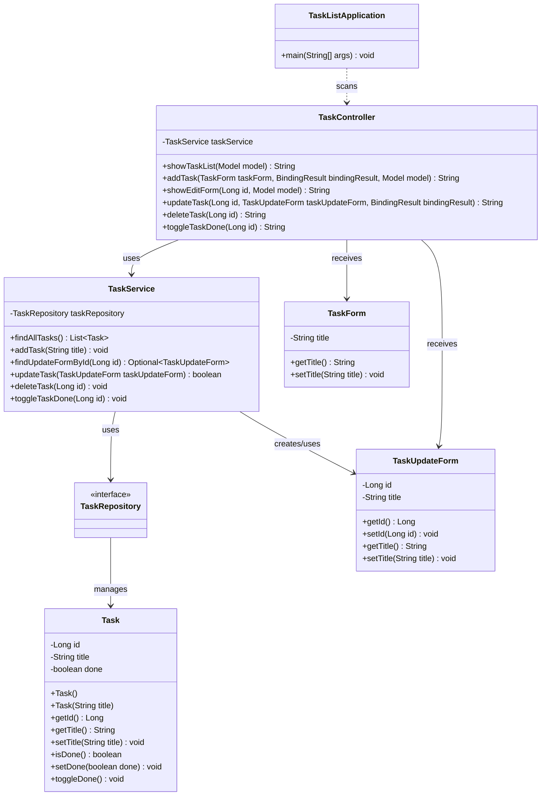

# TaskList

シンプルなタスク管理Webアプリです。  
Spring Boot を用いたWebアプリ開発の学習として作成しました。

Java / Spring Boot / JPA / H2 Database を使い、タスクの登録・一覧表示・更新・削除・完了状態の切り替えを実装しています。

## アプリケーション概要

ブラウザ上でタスクを管理できるWebアプリです。

現在は、以下の基本機能を実装しています。

- タスクの新規登録
- タスクの一覧表示
- タスクの更新
- タスクの削除
- 完了 / 未完了の切り替え
- 入力バリデーション

Spring Boot の基本的な構成に加えて、Controller / Service / Repository の役割分担を意識して実装しています。

## 主な機能

- タスクの一覧表示
- タスクの新規登録
- タスクの更新
- タスクの削除
- 入力バリデーション
  - 空文字のチェック
  - 空白のみの入力チェック
  - 長文入力のチェック
- 完了 / 未完了フラグの切り替え

## 使用技術

- Java 17
- Spring Boot
- Spring Data JPA（Hibernate）
- Thymeleaf
- H2 Database（開発用）
- Maven

## ディレクトリ構成

```
src/main/java/com/mkunori/tasklist
├─ TaskListApplication.java
├─ controller
│  └─ TaskController.java
├─ entity
│  └─ Task.java
├─ form
│  ├─ TaskForm.java
│  └─ TaskUpdateForm.java
├─ repository
│  └─ TaskRepository.java
└─ service
   └─ TaskService.java

src/main/resources
├─ templates
│  ├─ tasks.html
│  └─ edit-task.html
└─ application.properties
```

## パッケージの役割

| パッケージ | 役割 |
| ---- | ---- |
| controller | ブラウザからのリクエストを受け取り、画面遷移やService呼び出しを行う |
| service | タスクの追加・更新・削除・完了切り替えなど、アプリケーションの処理を担当する |
| repository | Spring Data JPAを使ってDB操作を行う |
| entity | DBテーブルに対応するJavaクラスを定義する |
| form | 画面から送信された入力値を受け取る |

## クラス図



## 処理の流れ

### タスク一覧表示

```text
ブラウザ
  ↓ GET /
TaskController
  ↓
TaskService
  ↓
TaskRepository
  ↓
H2 Database
  ↓
tasks.html
  ↓
ブラウザに表示
```

### タスク追加

```text
ブラウザのフォーム
  ↓ POST /tasks
TaskForm
  ↓
TaskController
  ↓
TaskService
  ↓
TaskRepository
  ↓
H2 Database
```

### タスク更新

```text
編集リンク
  ↓ GET /tasks/{id}/edit
TaskController
  ↓
TaskService
  ↓
TaskRepository
  ↓
edit-task.html

編集フォーム
  ↓ POST /tasks/{id}/update
TaskUpdateForm
  ↓
TaskController
  ↓
TaskService
  ↓
TaskRepository
  ↓
H2 Database
```

### 完了状態の切り替え

```text
完了ボタン
  ↓ POST /tasks/{id}/toggle
TaskController
  ↓
TaskService
  ↓
TaskRepository
  ↓
H2 Database
```

### タスク削除

```text
削除ボタン
  ↓ POST /tasks/{id}/delete
TaskController
  ↓
TaskService
  ↓
TaskRepository
  ↓
H2 Database
```

## 実行方法

### ① プロジェクトを取得

```bash
git clone <リポジトリURL>
cd tasklist
```

### ② アプリケーションを起動

（Windowsの場合）

```bash
mvnw.cmd spring-boot:run
```

または VSCode の Spring Boot Dashboard から実行可能です。

### ③ ブラウザでアクセス

```text
http://localhost:8080/
```

## データベース（H2）

開発用に H2 Database を使用しています。

### H2コンソール

```text
http://localhost:8080/h2-console
```

設定：

- JDBC URL: `jdbc:h2:./data/taskdb`
- User: `sa`
- Password: （空）

## 開発メモ

このアプリでは、開発用DBとしてH2を使用しています。  
`application.properties` では、以下のようにファイル保存型のH2 Databaseを使用しています。  
```
spring.datasource.url=jdbc:h2:./data/taskdb
```
そのため、実行するとプロジェクト直下に `data` ディレクトリが作成されます。  
このディレクトリはローカルのDBファイルなので、Git管理対象には含めません。  

Entityのフィールドを変更したあとにDB構造との不整合が起きた場合、開発初期であれば data ディレクトリを削除してDBを作り直すことがあります。

## 今後の改善予定

- 期限の追加
- 優先度の追加
- 検索・絞り込み機能
- PostgreSQL への移行
- ログイン機能
- 画面デザインの改善


## 学習ポイント

- Spring Boot によるWebアプリケーションの構築
- MVC構成の基本
- Controller / Service / Repository の役割分担
- Spring Data JPA によるDB操作
- JPAによるO/Rマッピング
- Thymeleafによる画面表示
- フォーム送信とバリデーション
- CRUD処理の実装
  - Create: タスク追加
  - Read: タスク一覧表示
  - Update: タスク更新、完了状態の切り替え
  - Delete: タスク削除
- H2 Databaseを使った開発用DBの利用

