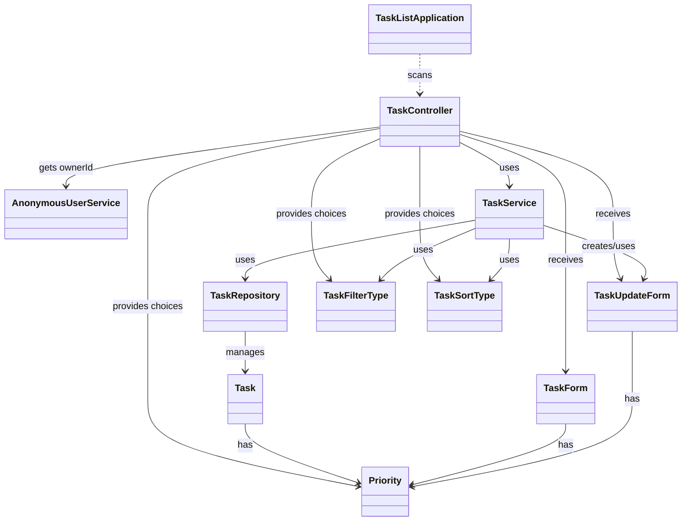
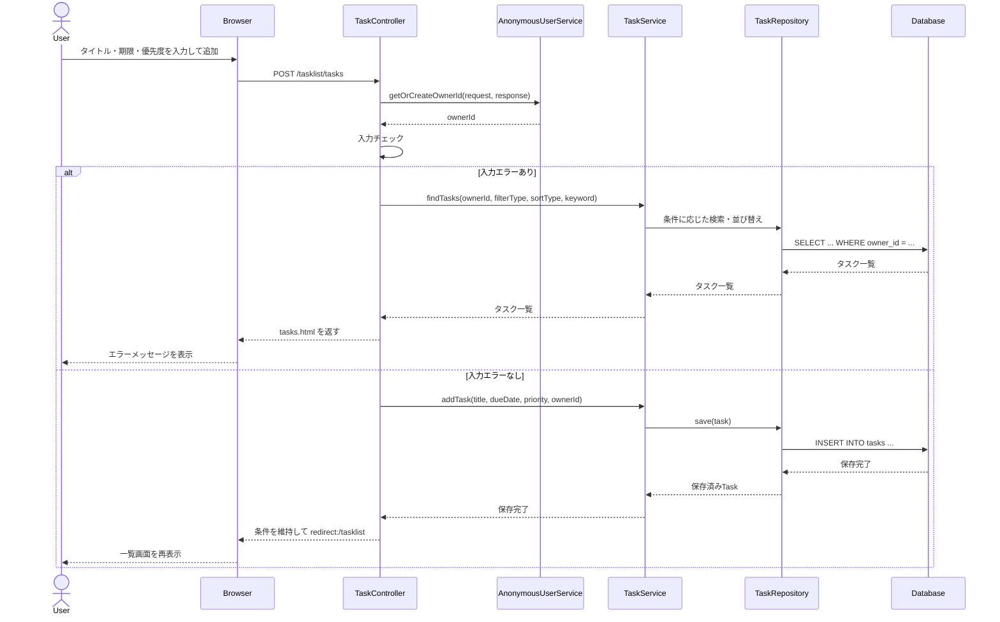
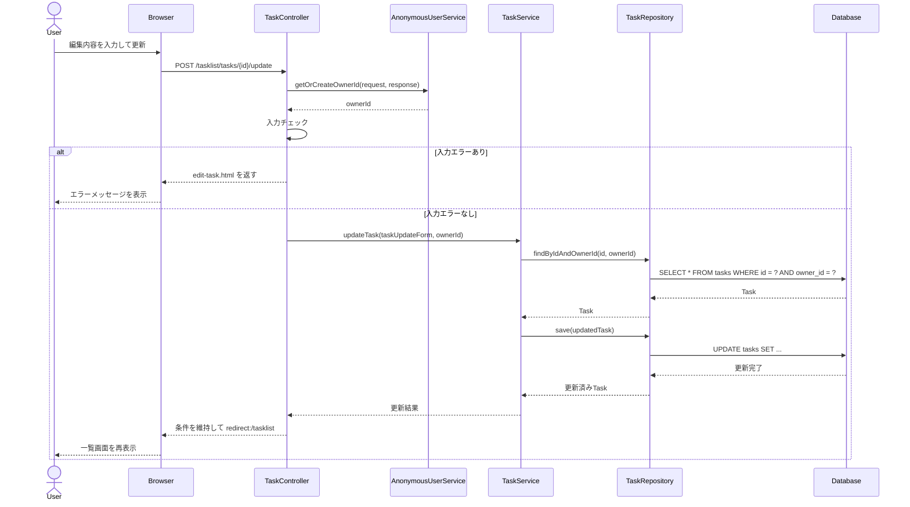
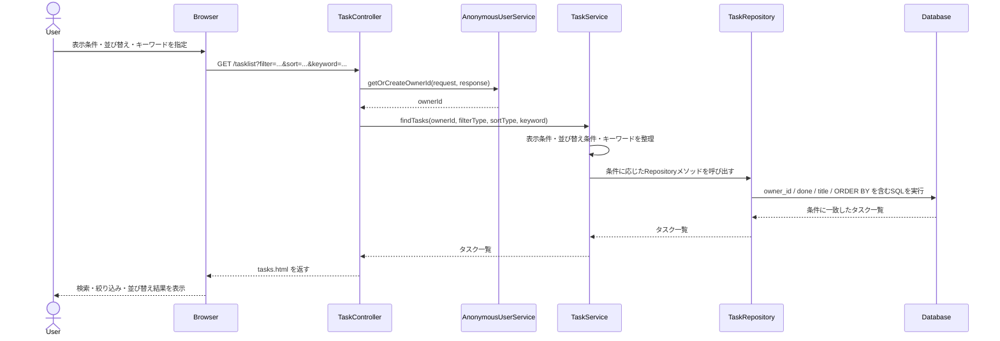

# TaskList

シンプルなタスク管理Webアプリです。  
Spring Boot を用いたWebアプリ開発の学習として作成しました。

Java / Spring Boot / JPA / H2 Database / PostgreSQL を使い、タスクの登録・一覧表示・更新・削除・完了状態の切り替え、期限・優先度の管理、絞り込み、キーワード検索、並び替え機能を実装しています。

タスク管理アプリとしての基本動作を見せることを優先するため、ログイン機能は実装していません。  
代わりに、Cookie ベースの匿名ユーザー識別を導入し、ブラウザごとにタスクを分離しています。

## アプリケーション概要

ブラウザ上でタスクを管理できるWebアプリです。

このアプリでは、タスク管理の基本操作や Spring Boot / JPA によるWebアプリ構成を見せることを優先しています。  
そのため、ユーザー登録やログイン機能は実装せず、Cookie による匿名ユーザー識別でブラウザごとにタスクを分離しています。

画面上部にはアプリケーション概要を表示し、基本的な使い方や、Cookieを使ってブラウザ単位でタスクを保持していることが分かるようにしています。

現在は、以下の基本機能を実装しています。

- タスクの新規登録
- タスクの一覧表示
- タスクの更新
- タスクの削除
- 完了 / 未完了の切り替え
- 期限の設定
- 期限切れ・今日が期限の表示
- 優先度の設定
- 完了状態による絞り込み
  - すべて
  - 未完了
  - 完了済み
- キーワード検索
- 並び替え
  - 登録順
  - 期限が近い順
  - 優先度が高い順
- 入力バリデーション
- 基本的なCSSによる表示改善

Spring Boot の基本的な構成に加えて、Controller / Service / Repository の役割分担を意識して実装しています。  

検索・絞り込み・並び替えは、Serviceで条件を判断し、Repository / DB側で条件付き取得を行う構成にしています。

## 主な機能

- タスクの一覧表示
- タスクの新規登録
- タスクの更新
- タスクの削除
- 完了 / 未完了フラグの切り替え
- 期限の登録・表示・更新
- 期限切れ・今日が期限の表示
- 優先度の登録・表示・更新
- 完了状態による絞り込み
  - すべて
  - 未完了
  - 完了済み
- タスクタイトルのキーワード検索
- タスク一覧の並び替え
  - 登録順
  - 期限が近い順
  - 優先度が高い順
- 入力バリデーション
  - 空文字のチェック
  - 空白のみの入力チェック
  - 長文入力のチェック
- 基本的なCSSによる表示改善
  - 完了済みタスクの取り消し線
  - 期限切れタスクの強調表示
  - 今日が期限のタスクの強調表示
  - エラーメッセージの強調表示
- Cookieベースの匿名ユーザー識別
  - ログインなしでブラウザごとにタスクを分離
  - Cookieに保存した匿名ユーザーIDを使用
  - DBでは `owner_id` によってタスクの所有者を管理
- 基本的なCSSによる表示改善
  - シンプルなカード型レイアウト
  - アプリ説明パネルの表示
  - 登録フォームと表示条件フォームの横並び表示
  - 画面幅が狭い場合の縦並び表示
  - 完了済みタスクの取り消し線
  - 期限切れタスクの強調表示
  - 今日が期限のタスクの強調表示
  - エラーメッセージの強調表示

## 使用技術

## 使用技術

- Java 21
- Spring Boot
- Spring Data JPA（Hibernate）
- JPQL（@Query）
- Thymeleaf
- H2 Database（開発用）
- PostgreSQL（実DB確認用）
- Maven
- HTML / CSS
- JUnit
- Mockito
- Spring MVC Test

## ディレクトリ構成

```text
src/main/java/com/mkunori/tasklist
├─ TaskListApplication.java        // アプリのエントリーポイント
├─ controller
│  └─ TaskController.java          // 画面表示やフォーム送信などのリクエストを受け取る
├─ entity
│  ├─ Priority.java                // タスクの優先度を表すenum
│  └─ Task.java                    // DBのtasksテーブルに対応するEntity
├─ form
│  ├─ TaskForm.java                // タスク新規登録フォームの入力値を受け取る
│  └─ TaskUpdateForm.java          // タスク編集フォームの入力値を受け取る
├─ repository
│  └─ TaskRepository.java          // Spring Data JPAでTaskをDB操作する
└─ service
   ├─ AnonymousUserService.java    // Cookieベースの匿名ユーザーIDを管理する
   ├─ TaskFilterType.java          // タスク一覧の表示条件を表すenum
   ├─ TaskService.java             // タスク追加・更新・削除・検索・絞り込み・並び替えなどの処理を担当する
   └─ TaskSortType.java            // タスク一覧の並び替え条件を表すenum

src/main/resources
├─ static
│  └─ css
│     └─ style.css                 // 基本的な画面スタイル
├─ templates
│  ├─ tasks.html                   // タスク一覧画面
│  └─ edit-task.html               // タスク編集画面
├─ application.properties          // H2 Database用の基本設定
└─ application-postgres.properties // PostgreSQL用プロファイル設定
```

## パッケージの役割

| パッケージ | 役割 |
| ---- | ---- |
| controller | ブラウザからのリクエストを受け取り、画面遷移やService呼び出しを行う |
| service | タスクの追加・更新・削除・完了切り替え・検索・絞り込み・並び替えなど、アプリケーションの処理を担当する |
| repository | Spring Data JPAを使ってDB操作を行う |
| entity | DBテーブルに対応するJavaクラスや、タスクの優先度を表すenumを定義する |
| form | 画面から送信された入力値を受け取る |

## クラス図


```mermaid
classDiagram
    class TaskListApplication
    class TaskController
    class AnonymousUserService
    class TaskService
    class TaskRepository
    class Task
    class Priority
    class TaskForm
    class TaskUpdateForm
    class TaskFilterType
    class TaskSortType

    TaskListApplication ..> TaskController : scans
    TaskController --> AnonymousUserService : gets ownerId
    TaskController --> TaskService : uses
    TaskController --> TaskForm : receives
    TaskController --> TaskUpdateForm : receives
    TaskController --> Priority : provides choices
    TaskController --> TaskFilterType : provides choices
    TaskController --> TaskSortType : provides choices
    TaskService --> TaskRepository : uses
    TaskService --> TaskUpdateForm : creates/uses
    TaskService --> TaskFilterType : uses
    TaskService --> TaskSortType : uses
    TaskRepository --> Task : manages
    Task --> Priority : has
    TaskForm --> Priority : has
    TaskUpdateForm --> Priority : has
```

## 匿名ユーザー識別

このアプリでは、タスク管理の基本動作を見せることを優先するため、ログイン機能は実装していません。  
代わりに、ブラウザのCookieに匿名ユーザーIDを保存し、そのIDを使ってブラウザごとにタスクを分離しています。

初回アクセス時にCookieが存在しない場合は、サーバ側で匿名ユーザーIDを作成し、Cookieへ保存します。  
以降は、そのCookieの値を使ってタスクを取得・追加・更新・削除します。

```text
ブラウザ
  ↓ Cookie
匿名ユーザーID
  ↓
Task.ownerId
  ↓
自分のタスクだけ表示・操作
```

## シーケンス図

### タスク追加


```mermaid
sequenceDiagram
    actor User
    participant Browser
    participant TaskController
    participant AnonymousUserService
    participant TaskService
    participant TaskRepository
    participant Database

    User->>Browser: タイトル・期限・優先度を入力して追加
    Browser->>TaskController: POST /tasklist/tasks
    TaskController->>AnonymousUserService: getOrCreateOwnerId(request, response)
    AnonymousUserService-->>TaskController: ownerId
    TaskController->>TaskController: 入力チェック

    alt 入力エラーあり
        TaskController->>TaskService: findTasks(ownerId, filterType, sortType, keyword)
        TaskService->>TaskRepository: 条件に応じた検索・並び替え
        TaskRepository->>Database: SELECT ... WHERE owner_id = ...
        Database-->>TaskRepository: タスク一覧
        TaskRepository-->>TaskService: タスク一覧
        TaskService-->>TaskController: タスク一覧
        TaskController-->>Browser: tasks.html を返す
        Browser-->>User: エラーメッセージを表示
    else 入力エラーなし
        TaskController->>TaskService: addTask(title, dueDate, priority, ownerId)
        TaskService->>TaskRepository: save(task)
        TaskRepository->>Database: INSERT INTO tasks ...
        Database-->>TaskRepository: 保存完了
        TaskRepository-->>TaskService: 保存済みTask
        TaskService-->>TaskController: 保存完了
        TaskController-->>Browser: 条件を維持して redirect:/tasklist
        Browser-->>User: 一覧画面を再表示
    end
```

### タスク更新


```mermaid
sequenceDiagram
    actor User
    participant Browser
    participant TaskController
    participant AnonymousUserService
    participant TaskService
    participant TaskRepository
    participant Database

    User->>Browser: 編集内容を入力して更新
    Browser->>TaskController: POST /tasklist/tasks/{id}/update
    TaskController->>AnonymousUserService: getOrCreateOwnerId(request, response)
    AnonymousUserService-->>TaskController: ownerId
    TaskController->>TaskController: 入力チェック

    alt 入力エラーあり
        TaskController-->>Browser: edit-task.html を返す
        Browser-->>User: エラーメッセージを表示
    else 入力エラーなし
        TaskController->>TaskService: updateTask(taskUpdateForm, ownerId)
        TaskService->>TaskRepository: findByIdAndOwnerId(id, ownerId)
        TaskRepository->>Database: SELECT * FROM tasks WHERE id = ? AND owner_id = ?
        Database-->>TaskRepository: Task
        TaskRepository-->>TaskService: Task
        TaskService->>TaskRepository: save(updatedTask)
        TaskRepository->>Database: UPDATE tasks SET ...
        Database-->>TaskRepository: 更新完了
        TaskRepository-->>TaskService: 更新済みTask
        TaskService-->>TaskController: 更新結果
        TaskController-->>Browser: 条件を維持して redirect:/tasklist
        Browser-->>User: 一覧画面を再表示
    end
```

### タスク検索・絞り込み・並び替え


```mermaid
sequenceDiagram
    actor User
    participant Browser
    participant TaskController
    participant AnonymousUserService
    participant TaskService
    participant TaskRepository
    participant Database

    User->>Browser: 表示条件・並び替え・キーワードを指定
    Browser->>TaskController: GET /tasklist?filter=...&sort=...&keyword=...
    TaskController->>AnonymousUserService: getOrCreateOwnerId(request, response)
    AnonymousUserService-->>TaskController: ownerId
    TaskController->>TaskService: findTasks(ownerId, filterType, sortType, keyword)
    TaskService->>TaskService: 表示条件・並び替え条件・キーワードを整理
    TaskService->>TaskRepository: 条件に応じたRepositoryメソッドを呼び出す
    TaskRepository->>Database: owner_id / done / title / ORDER BY を含むSQLを実行
    Database-->>TaskRepository: 条件に一致したタスク一覧
    TaskRepository-->>TaskService: タスク一覧
    TaskService-->>TaskController: タスク一覧
    TaskController-->>Browser: tasks.html を返す
    Browser-->>User: 検索・絞り込み・並び替え結果を表示
```

## 処理の流れ

### タスク一覧表示

```text
ブラウザ
  ↓ GET /tasklist
TaskController
  ↓
TaskService
  ↓
TaskRepository
  ↓
H2 Database
  ↓
tasks.html
  ↓
ブラウザに表示
```

### タスク追加

```text
ブラウザのフォーム
  ↓ POST /tasklist/tasks
TaskForm
  ↓
TaskController
  ↓
TaskService
  ↓
TaskRepository
  ↓
H2 Database
```

### タスク更新

```text
編集リンク
  ↓ GET /tasklist/tasks/{id}/edit
TaskController
  ↓
TaskService
  ↓
TaskRepository
  ↓
edit-task.html

編集フォーム
  ↓ POST /tasklist/tasks/{id}/update
TaskUpdateForm
  ↓
TaskController
  ↓
TaskService
  ↓
TaskRepository
  ↓
H2 Database
```

### 完了状態の切り替え

```text
完了ボタン
  ↓ POST /tasklist/tasks/{id}/toggle
TaskController
  ↓
TaskService
  ↓
TaskRepository
  ↓
H2 Database
```

### タスク削除

```text
削除ボタン
  ↓ POST /tasklist/tasks/{id}/delete
TaskController
  ↓
TaskService
  ↓
TaskRepository
  ↓
H2 Database
```

### タスク検索・絞り込み・並び替え

```text
表示条件・並び替え条件・キーワードを指定
  ↓ GET /tasklist?filter=ALL&sort=CREATED&keyword=
     GET /tasklist?filter=ACTIVE&sort=DUE_DATE&keyword=Spring
     GET /tasklist?filter=DONE&sort=PRIORITY&keyword=Java
TaskController
  ↓ Cookieから匿名ユーザーIDを取得
AnonymousUserService
  ↓ ownerId
TaskService
  ↓ 表示条件・並び替え条件・キーワードを整理
TaskRepository
  ↓ Repositoryメソッド名クエリ / @Query によるDB問い合わせ
Database
  ↓ 条件に一致したタスク一覧
tasks.html
```

## 表示条件

| 条件 | 内容 |
| ---- | ---- |
| すべて | すべてのタスクを表示します |
| 未完了 | 未完了のタスクだけを表示します |
| 完了済み | 完了済みのタスクだけを表示します |

## 並び替え条件

| 条件 | 内容 |
| ---- | ---- |
| 登録順 | IDの昇順で表示します |
| 期限が近い順 | 期限が近いタスクから表示します。期限なしのタスクは最後に表示します |
| 優先度が高い順 | HIGH、MEDIUM、LOW の順に表示します。同じ優先度の中では登録順で表示します |

## 期限表示

| 状態 | 表示例 |
| ---- | ---- |
| 期限なし | 期限なし |
| 期限切れ | 期限: 2026-05-10（期限切れ） |
| 今日が期限 | 期限: 2026-05-12（今日） |
| 通常の期限 | 期限: 2026-05-15 |

## 実行方法

### ① プロジェクトを取得

```bash
git clone <リポジトリURL>
cd tasklist
```

### ② アプリケーションを起動

Windowsの場合：

```bash
mvnw.cmd spring-boot:run
```

または VSCode の Spring Boot Dashboard から実行可能です。

### ③ ブラウザでアクセス

```text
http://localhost:8080/tasklist
```

## データベース

このアプリでは、開発用DBとして H2 Database を使用できます。  
また、PostgreSQL用プロファイルを用意しており、ローカルのPostgreSQLでも動作確認できます。

### H2 Database

通常起動時は、H2 Database を使用します。

### H2コンソール

```text
http://localhost:8080/h2-console
```

設定：

- JDBC URL: `jdbc:h2:./data/taskdb`
- User: `sa`
- Password: （空）

### PostgreSQL

PostgreSQLで起動する場合は、postgres プロファイルを指定します。  

事前に、PostgreSQL側で tasklist データベースを作成しておきます。  

```bash
CREATE DATABASE tasklist;
```

PostgreSQLプロファイルで起動します。  

```bash
.\mvnw.cmd spring-boot:run "-Dspring-boot.run.profiles=postgres"
```

## テスト実行方法

このアプリでは、JUnit と Mockito を使ってテストを作成しています。

現在は主に `TaskService` の単体テストを追加しています。  
Repository はモックにしているため、DBへ接続せずに Service の処理を確認できます。

### テスト実行コマンド

Windowsの場合：

```bash
mvnw.cmd test
```

### 現在テストしている主な内容

- Spring Bootアプリケーションの起動確認
- Taskエンティティの単体テスト
  - 完了状態の切り替え
  - 期限表示ラベルの生成
  - 期限状態に応じたCSSクラスの判定
- TaskServiceの単体テスト
  - タスク一覧取得
  - 完了 / 未完了による絞り込み
  - キーワード検索
  - 期限が近い順の並び替え
  - 優先度が高い順の並び替え
  - タスク追加時の保存処理
  - 完了状態の切り替え
  - タスク更新
  - タスク削除
- TaskControllerのテスト
  - 一覧画面表示
  - タスク追加
  - バリデーションエラー時の画面表示
  - 編集画面表示
  - タスク更新
  - 完了状態の切り替え
  - タスク削除
  - 操作後のリダイレクト
- AnonymousUserServiceの単体テスト
  - Cookieに匿名ユーザーIDがある場合はそのIDを返す
  - Cookieがない場合は新しいIDを作成してCookieへ保存する
- TaskFormのバリデーションテスト
  - 正しい入力ならエラーなし
  - タイトル空欄・空白のみ・長すぎる入力のチェック
  - 優先度未選択のチェック
  - 期限日未入力を許可することの確認
- TaskUpdateFormのバリデーションテスト
  - 正しい入力ならエラーなし
  - タイトル空欄・空白のみ・長すぎる入力のチェック
  - 優先度未選択のチェック
  - 期限日未入力を許可することの確認
- TaskRepositoryのテスト
  - ownerIdによるタスク分離
  - 完了状態による絞り込み
  - キーワード検索
  - 登録順・期限順・優先度順の並び替え
  - id + ownerId による取得・削除

### テスト対象

```text
src/test/java/com/mkunori/tasklist
├─ TaskListApplicationTests.java        // Spring Bootアプリの起動確認テスト
├─ controller
│  └─ TaskControllerTest.java           // TaskControllerのWeb層テスト
├─ entity
│  └─ TaskTest.java                     // Taskエンティティの単体テスト
├─ form
│  ├─ TaskFormTest.java                 // タスク登録フォームのバリデーションテスト
│  └─ TaskUpdateFormTest.java           // タスク編集フォームのバリデーションテスト
├─ repository
│  └─ TaskRepositoryTest.java           // TaskRepositoryのJPAテスト
└─ service
   ├─ AnonymousUserServiceTest.java     // Cookieベース匿名ユーザーID管理の単体テスト
   └─ TaskServiceTest.java              // TaskServiceの単体テスト
```

## 開発メモ

このアプリでは、開発用DBとしてH2を使用しています。  
`application.properties` では、以下のようにファイル保存型のH2 Databaseを使用しています。

```properties
spring.datasource.url=jdbc:h2:./data/taskdb
```

そのため、実行するとプロジェクト直下に `data` ディレクトリが作成されます。  
このディレクトリはローカルのDBファイルなので、Git管理対象には含めません。

Entityのフィールドを変更したあとにDB構造との不整合が起きた場合、開発初期であれば `data` ディレクトリを削除してDBを作り直すことがあります。

検索・絞り込み・並び替えは、Repository / DB側で行う構成にしています。

完了状態の絞り込みやキーワード検索は、Spring Data JPAのメソッド名クエリを使っています。    
また、期限順や優先度順のように少し複雑な並び替えは、`@Query` を使ってJPQLで明示しています。  

開発中にEntityのフィールドを変更した場合、既存のH2 Databaseに古いテーブル構造が残っているとエラーになることがあります。  
その場合、開発初期であれば `data` ディレクトリを削除してDBを作り直すことがあります。  

## 今後の改善予定

- PostgreSQL環境での動作確認強化
- 画面デザインのさらなる改善
  - スマートフォン表示の細かな調整
  - ボタンや余白の見た目改善
- デプロイ準備
  - 本番用プロファイルの整理
  - 環境変数による設定管理
- テストコードのさらなる拡充
  - Controller層の異常系テスト追加
  - 画面遷移やURL変更に関するテスト追加

## 学習ポイント

- Spring Boot によるWebアプリケーションの構築
- MVC構成の基本
- Controller / Service / Repository の役割分担
- Spring Data JPA によるDB操作
- JPAによるO/Rマッピング
- Thymeleafによる画面表示
- 静的CSSファイルの読み込み
- フォーム送信とバリデーション
- CRUD処理の実装
  - Create: タスク追加
  - Read: タスク一覧表示
  - Update: タスク更新、完了状態の切り替え
  - Delete: タスク削除
- `LocalDate` を使った期限日の管理
- `enum` を使った優先度・表示条件・並び替え条件の管理
- H2 Databaseを使った開発用DBの利用
- PostgreSQLプロファイルを使ったDB切り替え
- Spring Data JPAのメソッド名クエリによる検索・絞り込み
- `@Query` とJPQLによる複雑な並び替え
- DB側での検索・絞り込み・並び替え
- `ORDER BY CASE` を使った期限なし・優先度順の制御
- JUnit / Mockito を使った単体テスト
- MockMvc を使ったController層のテスト
- ServiceをモックにしたWeb層のテスト
- Cookieを使った匿名ユーザー識別
- ownerIdによるブラウザごとのタスク分離
- `@DataJpaTest` を使ったRepository層のテスト
- Bean Validationの単体テスト
- `Validator` を使ったForm入力チェックの確認
- Repositoryメソッド名クエリと `@Query` の動作確認
- CSS Gridを使ったシンプルなカード型レイアウト
- 画面幅に応じたフォーム配置の切り替え
- ユーザー向け説明文を画面上に表示するUI改善