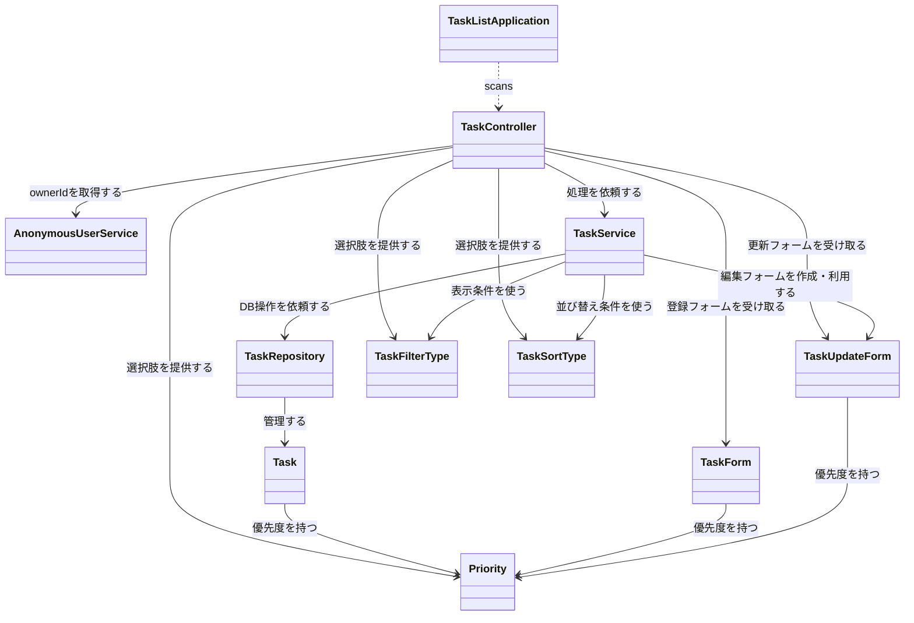
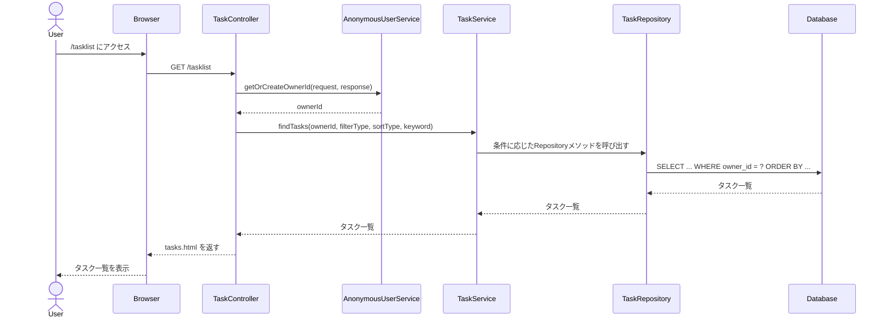
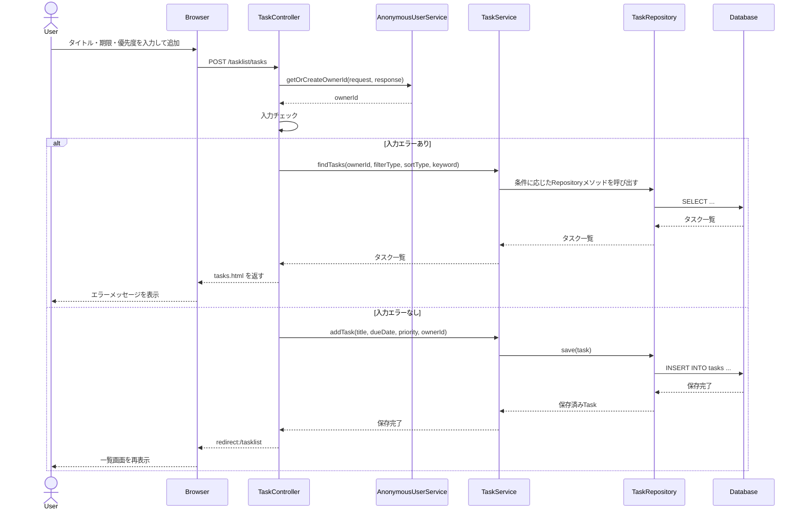
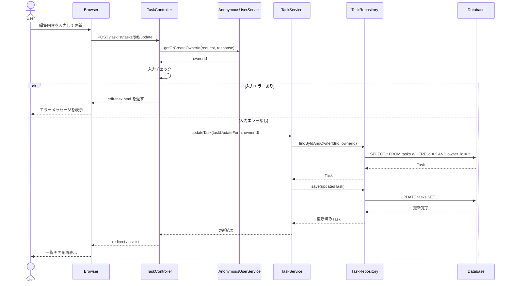
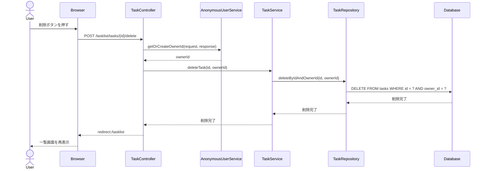

# TaskList

## ■ 概要

TaskListは、Java / Spring Boot / Spring Data JPA を使ったシンプルなタスク管理Webアプリケーションです。

ブラウザ上でタスクの追加、一覧表示、編集、削除、完了状態の切り替えを行えます。  
また、期限日、優先度、キーワード検索、完了状態による絞り込み、並び替えにも対応しています。

タスク管理アプリとしての基本動作を見せることを優先するため、ユーザー登録やログイン機能は実装していません。  
代わりに、Cookieベースの匿名ユーザー識別を導入し、ブラウザごとにタスクを分離しています。

現在は、さくらのVPS上にデプロイし、独自ドメインとHTTPSで公開しています。

## ■ 公開URL

以下のURLで公開しています。  
https://mkunori.com/tasklist

## ■ 使い方

本アプリは、PCブラウザでの利用を主に想定しています。  
スマートフォンなどの小さい画面でも表示できるように、簡単なレスポンシブ対応を行っています。

公開URLにアクセスし、画面上のフォームやボタンからタスクを操作できます。

- 新しいタスクを追加
  - タイトル
  - 期限
  - 優先度
- 表示条件
  - すべて
  - 未完了
  - 完了済み
- 並び替え
  - 登録順
  - 期限が近い順
  - 優先度が高い順
- キーワード検索
  - タスクタイトルを対象に検索

ログイン機能はありません。  
タスクはCookieを使ってブラウザ単位で保持されます。  
Cookieを削除した場合や、別のブラウザ・別のPCからアクセスした場合は、別のタスクリストとして扱われます。

## ■ 主な機能

### タスク管理

- タスクの新規登録
- タスクの一覧表示
- タスクの編集
- タスクの削除
- 完了 / 未完了の切り替え
- 期限日の登録・表示・更新
- 優先度の登録・表示・更新

### 表示・検索・並び替え

- 完了状態による絞り込み
  - すべて
  - 未完了
  - 完了済み
- タスクタイトルのキーワード検索
- タスク一覧の並び替え
  - 登録順
  - 期限が近い順
  - 優先度が高い順

検索・絞り込み・並び替えは、Serviceで条件を判断し、Repository / DB側で条件付き取得を行う構成にしています。

### 期限表示

- 期限なし
- 期限切れ
- 今日が期限
- 通常の期限

表示例：

```text
期限: 2026-05-10（期限切れ）
期限: 2026-05-12（今日）
期限: 2026-05-15
期限なし
```

### 入力バリデーション

- タイトル未入力のチェック
- 空白のみの入力チェック
- 長すぎるタイトルのチェック
- 優先度未選択のチェック
- 期限なしタスクの許可

### 匿名ユーザー識別

- Cookieに匿名ユーザーIDを保存
- DBでは owner_id によってタスクの所有者を管理
- ブラウザごとにタスクを分離
- タスク取得・更新・削除時に owner_id を条件に含める

### 画面表示

- シンプルなカード型レイアウト
- アプリ説明パネルの表示
- 登録フォームと表示条件フォームの横並び表示
- 画面幅が狭い場合の縦並び表示
- 完了済みタスクの取り消し線
- 期限切れタスクの強調表示
- 今日が期限のタスクの強調表示
- エラーメッセージの強調表示
- 操作後のスクロール位置復元

## ■ 技術構成

### Webアプリケーション

- Java 21
- Spring Boot
- Spring MVC
- Thymeleaf
- HTML / CSS
- JavaScript
  - sessionStorage を使ったスクロール位置復元
- Maven

### データベース

- Spring Data JPA
- Hibernate
- JPQL（@Query）
- H2 Database（開発用）
- PostgreSQL（本番想定 / VPS公開環境）

### テスト

- JUnit
- Mockito
- MockMvc
- @DataJpaTest
- Bean Validation
- Validator

### アプリケーション設計

- Controller / Service / Repository / Entity / Form の分離
- Cookieベース匿名ユーザー識別
- Repository / DB側での検索・絞り込み・並び替え
- @Transactional による削除処理のトランザクション管理

## ■ 公開環境

このアプリは、さくらのVPS上にデプロイし、独自ドメインとHTTPSで公開しています。

```text
Browser
↓
HTTPS
↓
Nginx
↓
TaskList Spring Boot Application : 8081
↓
PostgreSQL
```

### 主な構成

- さくらのVPS
- Ubuntu Server
- OpenJDK 21
- PostgreSQL
- Nginx
- systemd
- Let's Encrypt / Certbot

## ■ データベース

### PostgreSQL

PostgreSQL用プロファイルを用意しており、ローカルまたはVPS上のPostgreSQLでも動作確認できます。  
PostgreSQLで起動する場合は、事前に tasklist データベースを作成します。

```bash
CREATE DATABASE tasklist;
```

PostgreSQLプロファイルで起動します。

```bash
.\mvnw.cmd spring-boot:run "-Dspring-boot.run.profiles=postgres"
```

### prodプロファイル

本番想定の prod プロファイルでは、DB接続情報を環境変数から読み込みます。  
環境変数例：

```bash
TASKLIST_DB_URL=jdbc:postgresql://localhost:5432/tasklist
TASKLIST_DB_USER=tasklist_user
TASKLIST_DB_PASSWORD=your_password
SPRING_PROFILES_ACTIVE=prod
TASKLIST_PORT=8081
```

## ■ テスト

このアプリでは、JUnit / Mockito / MockMvc / @DataJpaTest を使ってテストを追加しています。

### 主なテスト内容

- Spring Bootアプリケーションの起動確認
- Entityの単体テスト
  - 完了状態の切り替え
  - 期限表示ラベルの生成
  - 期限状態に応じたCSSクラスの判定
- Formのバリデーションテスト
  - タイトル空欄・空白のみ・長すぎる入力のチェック
  - 優先度未選択のチェック
  - 期限日未入力を許可することの確認
- Repository層のJPAテスト
  - ownerIdによるタスク分離
  - 完了状態による絞り込み
  - キーワード検索
  - 登録順・期限順・優先度順の並び替え
  - id + ownerId による取得・削除
- Service層の単体テスト
  - タスク一覧取得
  - タスク追加
  - タスク更新
  - タスク削除
  - 完了状態の切り替え
- AnonymousUserServiceの単体テスト
  - Cookieに匿名ユーザーIDがある場合はそのIDを返す
  - Cookieがない場合は新しいIDを作成してCookieへ保存する
- Controller層のテスト
  - 一覧画面表示
  - タスク追加
  - バリデーションエラー時の画面表示
  - 編集画面表示
  - タスク更新
  - 完了状態の切り替え
  - タスク削除
  - 操作後のリダイレクト

### テスト実行

```bash
.\mvnw.cmd test
```

## ■ パッケージ構成

```text
src/main/java/com/mkunori/tasklist
├─ TaskListApplication.java        // Spring Bootアプリケーションのエントリーポイント
├─ controller
│  └─ TaskController.java          // 画面表示やフォーム送信などのリクエストを受け取る
├─ entity
│  ├─ Priority.java                // タスクの優先度を表すenum
│  └─ Task.java                    // DBのtasksテーブルに対応するEntity
├─ form
│  ├─ TaskForm.java                // タスク新規登録フォームの入力値を受け取る
│  └─ TaskUpdateForm.java          // タスク編集フォームの入力値を受け取る
├─ repository
│  └─ TaskRepository.java          // Spring Data JPAでTaskをDB操作する
└─ service
   ├─ AnonymousUserService.java    // Cookieベースの匿名ユーザーIDを管理する
   ├─ TaskFilterType.java          // タスク一覧の表示条件を表すenum
   ├─ TaskService.java             // タスク追加・更新・削除・検索・絞り込み・並び替えなどの処理を担当する
   └─ TaskSortType.java            // タスク一覧の並び替え条件を表すenum

src/main/resources
├─ static
│  └─ css
│     └─ style.css                 // 画面スタイル
├─ templates
│  ├─ tasks.html                   // タスク一覧画面
│  └─ edit-task.html               // タスク編集画面
├─ application.properties          // H2 Database用の基本設定
├─ application-postgres.properties // PostgreSQL用プロファイル設定
└─ application-prod.properties     // 本番想定プロファイル設定

src/test/java/com/mkunori/tasklist
├─ TaskListApplicationTests.java   // Spring Bootアプリケーションの起動確認
├─ controller
│  └─ TaskControllerTest.java      // TaskControllerのWeb層テスト
├─ entity
│  └─ TaskTest.java                // Taskエンティティの単体テスト
├─ form
│  ├─ TaskFormTest.java            // タスク登録フォームのバリデーションテスト
│  └─ TaskUpdateFormTest.java      // タスク編集フォームのバリデーションテスト
├─ repository
│  └─ TaskRepositoryTest.java      // TaskRepositoryのJPAテスト
└─ service
   ├─ AnonymousUserServiceTest.java // Cookieベース匿名ユーザーID管理の単体テスト
   └─ TaskServiceTest.java          // TaskServiceの単体テスト
```

## クラス図


```mermaid
classDiagram
    class TaskListApplication
    class TaskController
    class AnonymousUserService
    class TaskService
    class TaskRepository
    class Task
    class Priority
    class TaskForm
    class TaskUpdateForm
    class TaskFilterType
    class TaskSortType

    TaskListApplication ..> TaskController : scans
    TaskController --> AnonymousUserService : ownerIdを取得する
    TaskController --> TaskService : 処理を依頼する
    TaskController --> TaskForm : 登録フォームを受け取る
    TaskController --> TaskUpdateForm : 更新フォームを受け取る
    TaskController --> Priority : 選択肢を提供する
    TaskController --> TaskFilterType : 選択肢を提供する
    TaskController --> TaskSortType : 選択肢を提供する

    TaskService --> TaskRepository : DB操作を依頼する
    TaskService --> TaskUpdateForm : 編集フォームを作成・利用する
    TaskService --> TaskFilterType : 表示条件を使う
    TaskService --> TaskSortType : 並び替え条件を使う

    TaskRepository --> Task : 管理する
    Task --> Priority : 優先度を持つ
    TaskForm --> Priority : 優先度を持つ
    TaskUpdateForm --> Priority : 優先度を持つ
```

## シーケンス図

### 初期表示・一覧表示


```mermaid
sequenceDiagram
    actor User
    participant Browser
    participant Controller as TaskController
    participant Anonymous as AnonymousUserService
    participant Service as TaskService
    participant Repository as TaskRepository
    participant DB as Database

    User->>Browser: /tasklist にアクセス
    Browser->>Controller: GET /tasklist
    Controller->>Anonymous: getOrCreateOwnerId(request, response)
    Anonymous-->>Controller: ownerId
    Controller->>Service: findTasks(ownerId, filterType, sortType, keyword)
    Service->>Repository: 条件に応じたRepositoryメソッドを呼び出す
    Repository->>DB: SELECT ... WHERE owner_id = ? ORDER BY ...
    DB-->>Repository: タスク一覧
    Repository-->>Service: タスク一覧
    Service-->>Controller: タスク一覧
    Controller-->>Browser: tasks.html を返す
    Browser-->>User: タスク一覧を表示
```

### タスク追加


```mermaid
sequenceDiagram
    actor User
    participant Browser
    participant Controller as TaskController
    participant Anonymous as AnonymousUserService
    participant Service as TaskService
    participant Repository as TaskRepository
    participant DB as Database

    User->>Browser: タイトル・期限・優先度を入力して追加
    Browser->>Controller: POST /tasklist/tasks
    Controller->>Anonymous: getOrCreateOwnerId(request, response)
    Anonymous-->>Controller: ownerId
    Controller->>Controller: 入力チェック

    alt 入力エラーあり
        Controller->>Service: findTasks(ownerId, filterType, sortType, keyword)
        Service->>Repository: 条件に応じたRepositoryメソッドを呼び出す
        Repository->>DB: SELECT ...
        DB-->>Repository: タスク一覧
        Repository-->>Service: タスク一覧
        Service-->>Controller: タスク一覧
        Controller-->>Browser: tasks.html を返す
        Browser-->>User: エラーメッセージを表示
    else 入力エラーなし
        Controller->>Service: addTask(title, dueDate, priority, ownerId)
        Service->>Repository: save(task)
        Repository->>DB: INSERT INTO tasks ...
        DB-->>Repository: 保存完了
        Repository-->>Service: 保存済みTask
        Service-->>Controller: 保存完了
        Controller-->>Browser: redirect:/tasklist
        Browser-->>User: 一覧画面を再表示
    end
```

### タスク更新


```mermaid
sequenceDiagram
    actor User
    participant Browser
    participant Controller as TaskController
    participant Anonymous as AnonymousUserService
    participant Service as TaskService
    participant Repository as TaskRepository
    participant DB as Database

    User->>Browser: 編集内容を入力して更新
    Browser->>Controller: POST /tasklist/tasks/{id}/update
    Controller->>Anonymous: getOrCreateOwnerId(request, response)
    Anonymous-->>Controller: ownerId
    Controller->>Controller: 入力チェック

    alt 入力エラーあり
        Controller-->>Browser: edit-task.html を返す
        Browser-->>User: エラーメッセージを表示
    else 入力エラーなし
        Controller->>Service: updateTask(taskUpdateForm, ownerId)
        Service->>Repository: findByIdAndOwnerId(id, ownerId)
        Repository->>DB: SELECT * FROM tasks WHERE id = ? AND owner_id = ?
        DB-->>Repository: Task
        Repository-->>Service: Task
        Service->>Repository: save(updatedTask)
        Repository->>DB: UPDATE tasks SET ...
        DB-->>Repository: 更新完了
        Repository-->>Service: 更新済みTask
        Service-->>Controller: 更新結果
        Controller-->>Browser: redirect:/tasklist
        Browser-->>User: 一覧画面を再表示
    end
```

### タスク削除


```mermaid
sequenceDiagram
    actor User
    participant Browser
    participant Controller as TaskController
    participant Anonymous as AnonymousUserService
    participant Service as TaskService
    participant Repository as TaskRepository
    participant DB as Database

    User->>Browser: 削除ボタンを押す
    Browser->>Controller: POST /tasklist/tasks/{id}/delete
    Controller->>Anonymous: getOrCreateOwnerId(request, response)
    Anonymous-->>Controller: ownerId
    Controller->>Service: deleteTask(id, ownerId)
    Service->>Repository: deleteByIdAndOwnerId(id, ownerId)
    Repository->>DB: DELETE FROM tasks WHERE id = ? AND owner_id = ?
    DB-->>Repository: 削除完了
    Repository-->>Service: 削除完了
    Service-->>Controller: 削除完了
    Controller-->>Browser: redirect:/tasklist
    Browser-->>User: 一覧画面を再表示
```

## ■ 学習ポイント

このプロジェクトでは、タスク管理アプリを題材に、Spring BootによるWebアプリケーション開発、RDB連携、テスト、VPS公開までを実践しました。

### Webアプリケーション開発

- Spring BootによるWebアプリケーション構築
- MVC構成の基本
- Controller / Service / Repository の責務分離
- Thymeleafによる画面表示
- フォーム送信とバリデーション
- CRUD処理の実装
- LocalDate を使った期限日の管理
- enum を使った優先度・表示条件・並び替え条件の管理
- Cookieを使った匿名ユーザー識別
- sessionStorage を使った画面再表示後のスクロール位置復元
- CSS Gridを使ったシンプルなカード型レイアウト

### データベース

- Spring Data JPAによるDB操作
- JPA / HibernateによるO/Rマッピング
- H2 Databaseを使った開発用DBの利用
- PostgreSQLを使った本番想定DB接続
- Repositoryメソッド名クエリによる検索・絞り込み
- @Query とJPQLによる複雑な並び替え
- ORDER BY CASE を使った期限なし・優先度順の制御
- @Transactional を使った削除処理のトランザクション管理

### 公開・運用

- VPS上でのSpring Bootアプリケーション公開
- Nginxによるリバースプロキシ設定
- systemdによるJavaアプリケーションのサービス化
- 独自ドメインとLet's Encrypt / CertbotによるHTTPS化
- PostgreSQLをVPS上に構成してアプリから接続

## ■ 今後改善していくならば

### アプリケーション機能

- 操作結果メッセージの表示
- Cookie削除時の扱い説明の改善

### 画面表示

- スマートフォン表示の細かな調整
- ボタンや余白の見た目改善

### コード設計・テスト

- Controller層の異常系テスト追加
- 画面遷移やURL変更に関するテスト追加
- Repository層の組み合わせ条件テスト追加
- Flywayなどの導入検討
